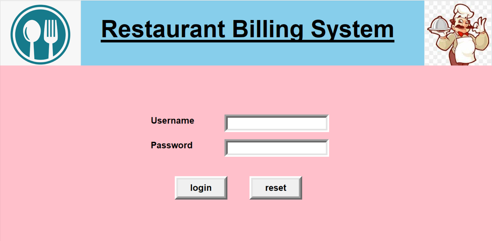

# Restaurant Billing System

Restaurant Billing System is a desktop application in which you can add or edit items and generate the bills.
Developed a GUI-based billing application for restaurants to streamline order processing and invoice generation. The system allows users to select menu items, calculate totals, generate digital receipts, and store transaction data persistently using SQLite.

## Tech Used:

- Python
- Tkinter
- SQLite
